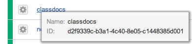

# Cloud Server Backup Imaging

This script allows you to have scheduled image backups of your server. It is meant to be run as a cron job, but can also be run directly if desired.

It requires [`pyrax`](https://github.com/rackspace/pyrax), the Python SDK for the Rackspace Cloud.

## Command Line Arguments

You will need to pass your cloud account credentials to the script, along with the ID (or IDs) of the server(s) you wish to back up. You must also specify how many backup images to retain for each server. Here is a listing of the parameters that image_backup accepts, and what they affect:

    -h, --help          show this help message and exit

    --username USERNAME, -u USERNAME
                        The account's username

    --api-key API_KEY, -k API_KEY
                        The account's API key

    --server-id SERVER_ID, -s SERVER_ID
                        The ID of the server to back up. You may specify this
                        parameter multiple times to back up multiple servers.

    --backup-count BACKUP_COUNT, -b BACKUP_COUNT
                        Number of backups to retain per server. After this
                        limit is reached, the oldest backups will be deleted.

    --persist, -p       Store the values specified as parameters in this call
                        to be used as the default in future runs.

## Configuring

There are two ways to configure this script. The first is to pass all the values that are needed as parameters with every call to the script, and the second is to pass them once and tell the script to persist them. If you choose the second option, future calls to the script will not need to pass credentials or server information, as the script will use the stored values.

If you have the script store your information, you can always override those stored values by calling the script with whatever parameters you wish to change. Adding the '--persist' parameter will write those changes so that they are the defaults for any future call.

## Getting the IDs of your Servers

If you are already using pyrax to create cloud applications, then listing your servers and their IDs is straightforward:

    servers = pyrax.cloudservers.servers.list()
    for server in servers:
        print server.name, server.id

If you're not a Python developer, then go to the [Rackspace Cloud Control Panel](https://mycloud.rackspace.com), and on the page that lists your servers, hover the mouse over the server name. A small window will pop up that will show the server's name and ID:

&nbsp; |
---: |
 | 

If you are using a mobile device or other browser that doesn't support hover, click on the server and note the URL of the page for the server details. It will look something like this:

    https://mycloud.rackspace.com/a/your_account/#compute%2CcloudServersOpenStack%2CORD/d2f9339c-b3a1-4c40-8e05-c1448385d001

Note the part after the last slash: that's the server's ID.

## Scheduling backups for multiple servers

You can specify the `--server-id` parameter multiple times in the call to image_backup: once for each server you wish to backup. The servers can be located in any datacenter.

To illustrate, assume that you have 3 servers with the following IDs:

    AAAAA-AAAAA
    BBBBB-BBBBB
    CCCCC-CCCCC

Of course, actual IDs will be much longer, but these will do for this example.

To configure image_backup to back up all three of these servers, run the following command:

    python /path/to/image_backup.py \
      --username your_username \
      --api-key your_api_key \
      --server-id AAAAA-AAAAA \
      --server-id BBBBB-BBBBB \
      --server-id CCCCC-CCCCC \
      --backup-count 7 \
      --persist

Note that all three servers were included, each with its own `--server-id` parameter label. The inclusion of `--persist` ensures that these values are stored as defaults so that future calls will not need to specify any of these values again.

## Adding to cron

To schedule the backup image creation, add a cron job. If you are unfamiliar with `cron`, it is a built-in utility for running programs at regular intervals.

If you run the script manually first with the 'persist' option, your username, API key, server(s) to backup, and number of backup images to retain will be stored, and the line in your cron file will not need to include any parameters. Otherwise you will have to include all the values needed by the script as parameters in your cron entry. The examples below assume that you have run and stored all the required values already.

To add a daily backup, run `crontab -e`, and add the following line:

     15 3 * * * /usr/bin/python /path/to/image_backup.py

This will run once a day at 3:15 am. To run at a different time, change the values in the first two columns to the desired values.

For a weekly backup, change the last asterisk to a value between 0-6 (Sunday-Saturday):

     40 22 * * 5 /usr/bin/python /path/to/image_backup.py

This will run the script every Friday at 10:40 pm.

## Debugging Problems

After running the script you can go to the Rackspace Cloud Control Panel, and on each server's page, you can click the 'View Images' link to see the backup images. All backups are named in this format: `server_name-datetime`. The datetime value is in YYYYMMDDHHMMSS format.

If the images are not being created as expected, you can run the script manually, and it will print out any error information it encounters. You can also check the system logs for any entries from the script. Each syslog entry created by the script is prefixed with the word "RackspaceImageScheduler", so searching for the script's output is simple.

If that information isn't enough to help you figure out what the problem is, or you have any other problems, please [open an issue on GitHub](https://github.com/rackspace/image_backup/issues) and we'll try to answer it as soon as possible.